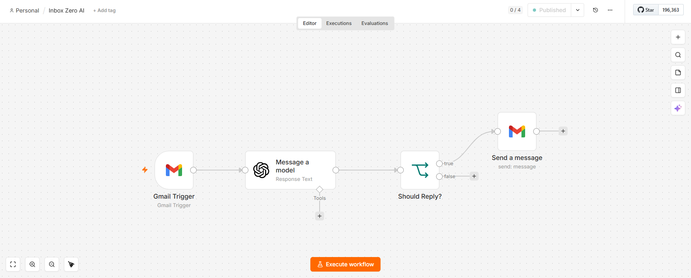
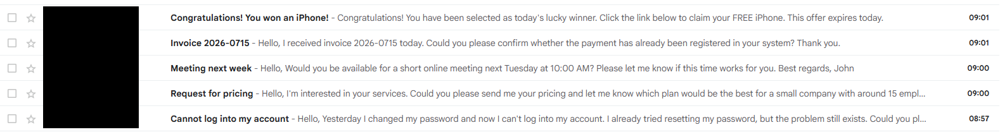
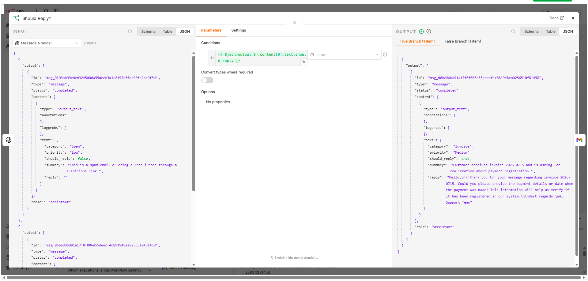
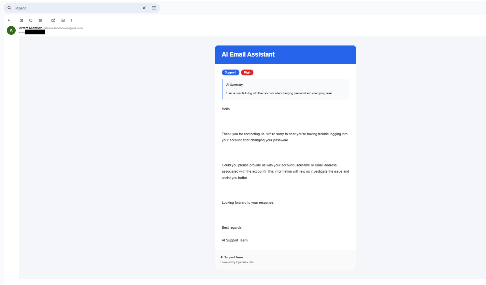
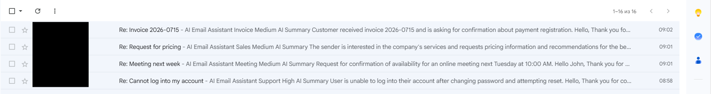

# AI Email Assistant

An AI-powered email automation workflow built with n8n, OpenAI and Gmail.

The assistant automatically classifies incoming emails, determines whether a reply is required, generates professional responses, and ignores spam or promotional messages.

## ✨ Features

- 📥 Automatically processes incoming Gmail messages
- 🧠 Classifies emails using OpenAI
- 🏷️ Detects category and priority
- 🚫 Ignores spam and newsletters
- ✉️ Generates professional email replies
- 🌍 Detects the email language automatically
- ⚡ Built entirely in n8n using a low-code workflow

## 🛠️ Technologies

- n8n
- OpenAI API
- Gmail API
- JSON
- AI Prompt Engineering

  ## 🔄 Workflow

```text
Incoming Email
       │
       ▼
 Gmail Trigger
       │
       ▼
OpenAI Analysis
       │
       ▼
Classify Email
(Category + Priority)
       │
       ▼
Should Reply?
   │          │
   │Yes       │No
   ▼          ▼
Generate    Ignore
 Reply      (Spam)
   │
   ▼
Send via Gmail
```

The workflow automatically:

1. Receives a new email from Gmail.
2. Sends the content to OpenAI.
3. Detects language, category and priority.
4. Decides whether the email requires a reply.
5. Generates a professional response.
6. Sends the reply back through Gmail.

7. ## 📸 Screenshots

### Workflow Overview

The complete automation workflow built in n8n.



---

### Incoming Emails

Example emails used to test the assistant.



---

### AI Decision

OpenAI returns structured JSON including:

- Category
- Priority
- Summary
- Reply
- should_reply



---

### Generated Reply

Professional AI-generated response ready to be sent.



---

### Final Result

The assistant automatically replies only to relevant emails while ignoring spam.



## 🚀 Future Improvements

- Gmail labels based on AI classification
- Google Sheets logging
- Human approval mode
- RAG with company knowledge base
- CRM integration
- Calendar integration
- Multi-agent architecture
- Support for file attachments

  ## 📥 Import Workflow

1. Download the workflow JSON file.
2. Import it into n8n.
3. Configure your Gmail credentials.
4. Configure your OpenAI API credentials.
5. Activate the workflow.

  ## 📄 License

This project is licensed under the MIT License. 

---
